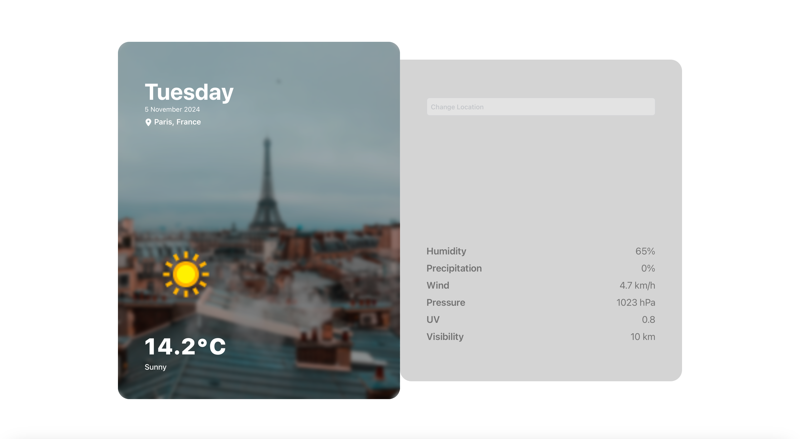

# Weather App
This React application provides a user-friendly interface to fetch real-time weather data based on location. Users can view current weather conditions, including temperature, weather description, humidity, precipitation, wind speed, pressure, UV index, and visibility. They can also search for weather information in different locations using the search function.

## Features
- **Geolocation Support**: Leverages the user's browser geolocation API to automatically retrieve current location and display weather data accordingly.
- **Search Functionality**: Allows users to search for weather information in any location by entering a city name.
- **Weather Display**: Displays current weather conditions with clear icons, temperature in Celsius (°C), descriptive text, and detailed weather metrics.
- **Responsive Design**: Adapts to different screen sizes for optimal viewing on desktops, mobiles, and tablets.

## Technologies Used

- **Backend:**
  - Python
  - FastAPI
  - Requests library for API calls
  - CORS middleware for handling cross-origin requests

- **Frontend:**
  - React
  - JavaScript
  - Tailwind CSS
  - Unsplash API
  - React-Icons for icons


## Backend
This project is integrated with a backend API written in Python using FastAPI. The backend API handles the following tasks:

- **Reverse Geocoding**: Uses the [***PositionStack API***](https://positionstack.com/) to translate user coordinates into a city name and country.
- **Weather Data Fetching**: Employs the [***WeatherAPI***](https://www.weatherapi.com/) to retrieve weather data for a given location.

## Frontend
The frontend, responsive user-interface is built using React via ```create-react-app```, involving Tailwind CSS to style the content and Node JS for package management. Frontend javascript code communicate with the backend API exchanging data to function the app.

## License

This project is licensed under the MIT License. See the ```LICENSE``` file for details.

## Demo Examples

